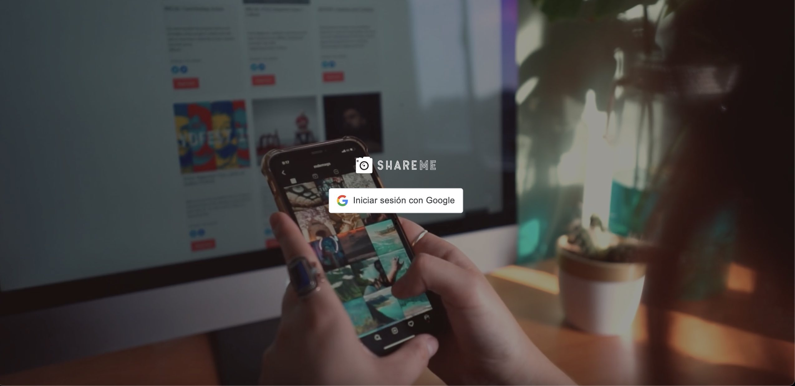
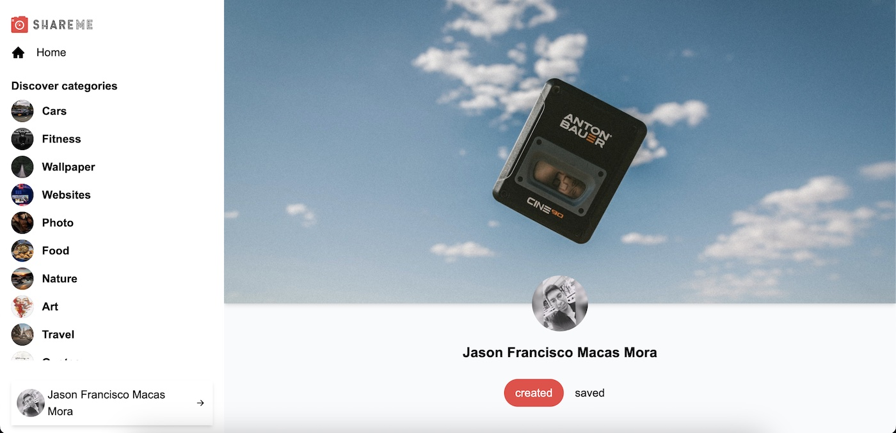

### Shareme
A social media app made with React.js and Sanity, design inspired by pinterest. Allows users to create and like posts. It also allows authentication through Google OAuth2. Frontend uses tailwind for styles. The site is full responsive.

### 🎨 Frontend
- React
- React Router DOM
- Tailwind

### ⚡️ Backend
- Sanity
- Google Auth